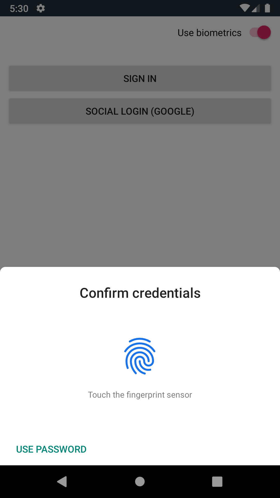
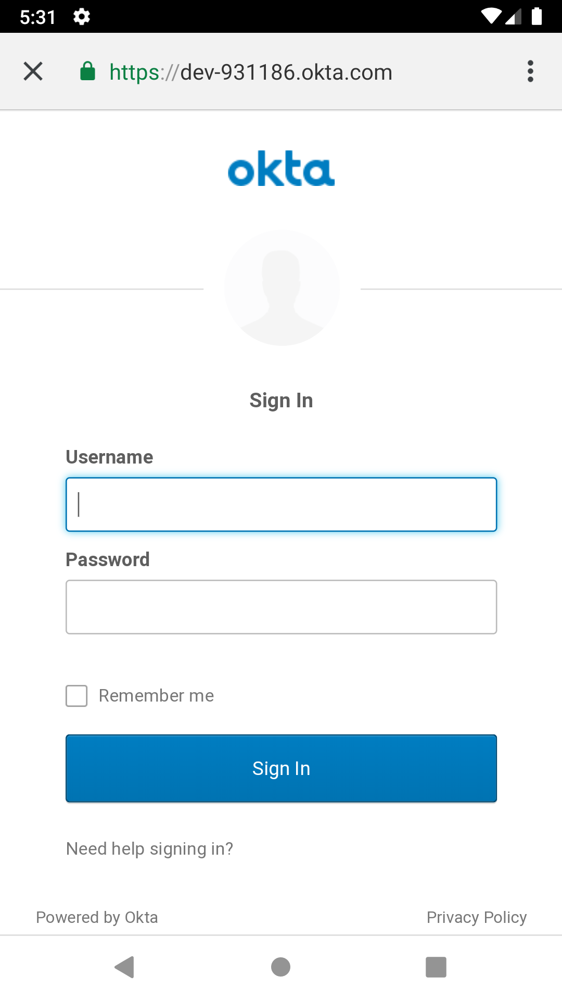
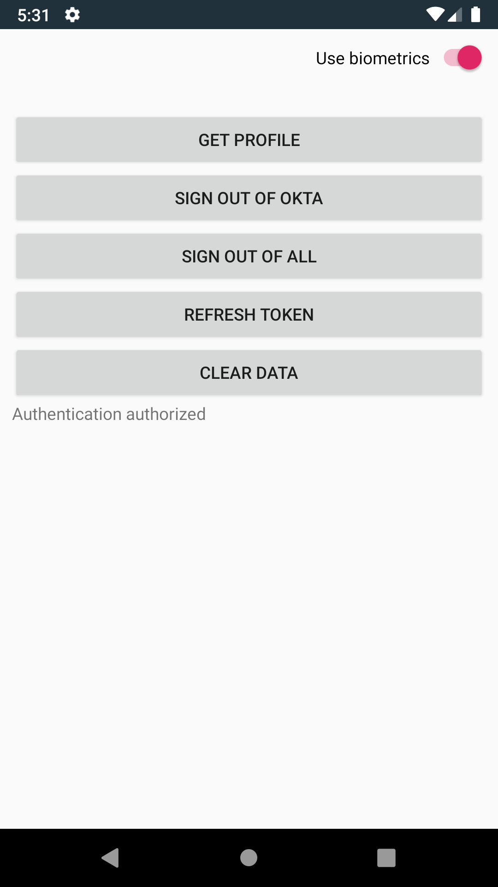

# Okta OIDC SDK sample with Oauth 2.0 + OpenID Connect + Biometrics

This repository contains an example showcasing how to use [Okta OIDC SDK](https://github.com/okta/okta-oidc-android) implementing:
- Oauth 2.0 + OpenID Connect authentication against Okta
- Oauth 2.0 + OpenID Connect authentication against external Identity Providers like Google, LinkedIn, Microsoft, ...
- Kotlin wrapper for `BiometricPrompt` and sample usage
- Usage of custom OkHttp client with Okta OIDC SDK 

## Instructions

You can create a freeOkta developer account at [https://developer.okta.com/](https://developer.okta.com/).

1. After login, from the Admin dashboard, navigate to **Applications**&rarr;**Add Application**
2. Choose **Native** as the platform
3. Populate your new Native OpenID Connect application with values similar to:

| Setting              | Value                                               |
| -------------------- | --------------------------------------------------- |
| Application Name     | Native OpenId Connect App *(must be unique)*        |
| Login URI            | com.okta.oidc.example:/callback                     |
| End Session URI      | com.okta.oidc.example:/logout                       |
| Allowed grant types  | Authorization Code, Refresh Token *(recommended)*   |

4. Click **Finish** to redirect back to the *General Settings* of your application
5. Copy the **Client ID**, as it will be needed for the client configuration
6. Get your Org URL form the top-right of the Admin dashboard. For example, https://dev-1234.okta.com/
7. Update the values in `app/build.gradle` to fit those you obtained in previous steps
8. Update the `appAuthRedirectScheme` manifestPlaceholder in `app/build.gradle` with yours

## Screenshots

